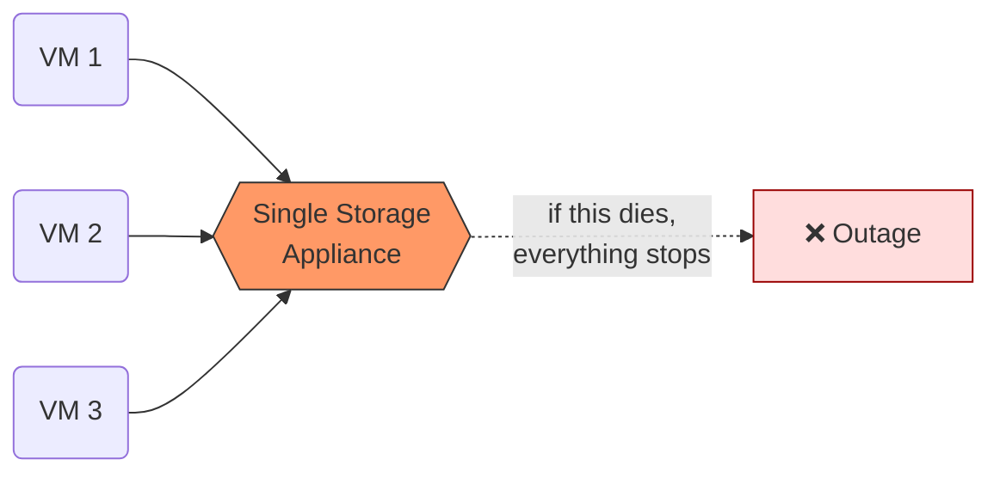
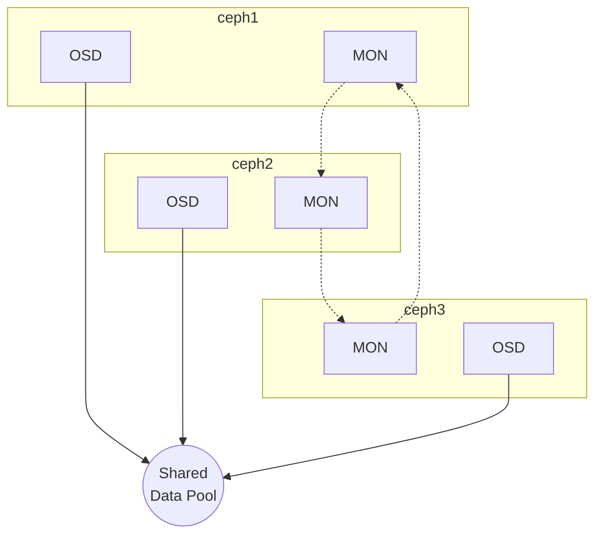
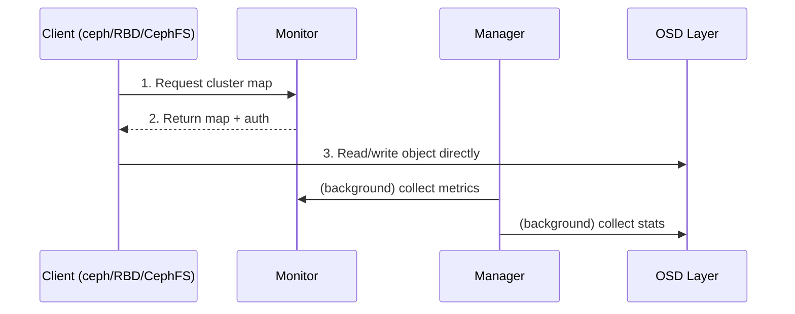
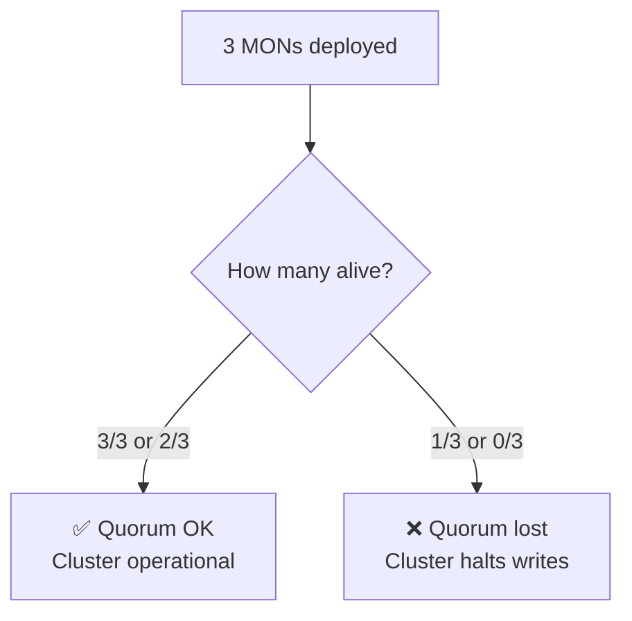
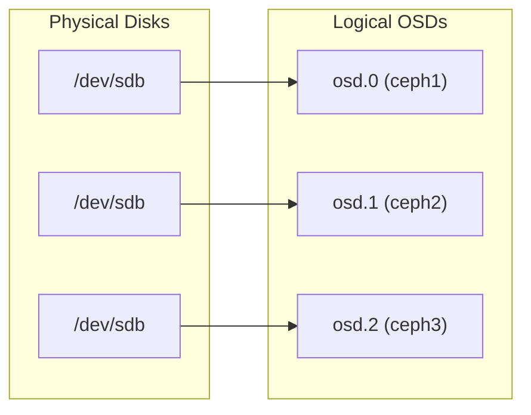
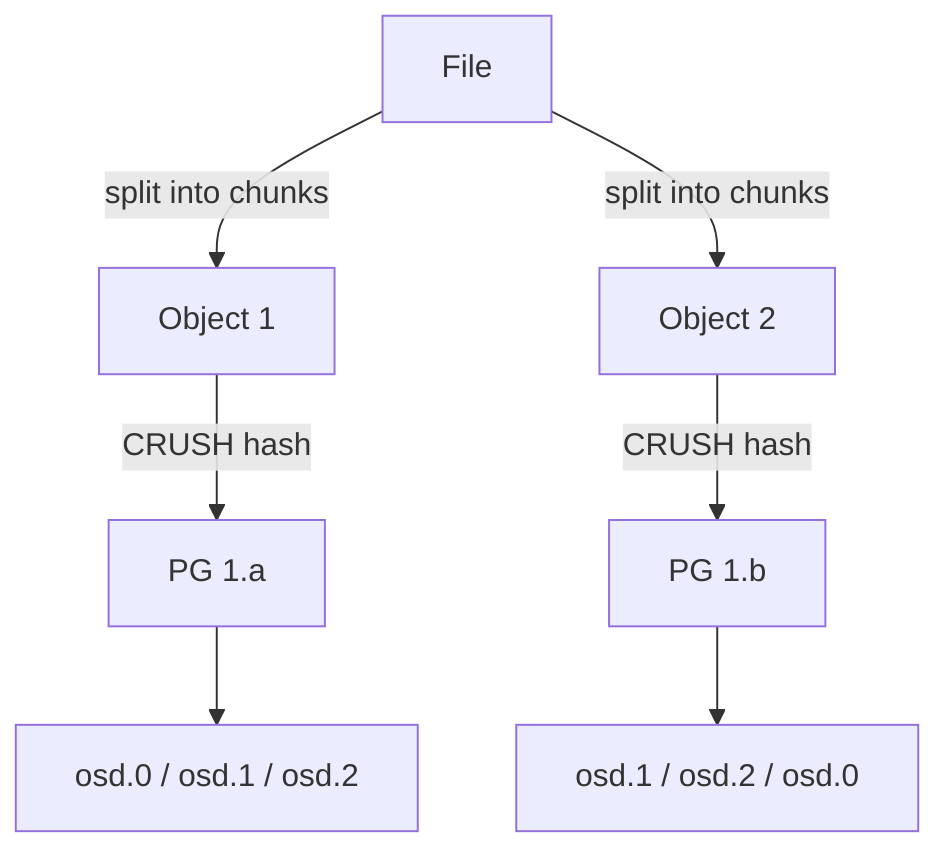
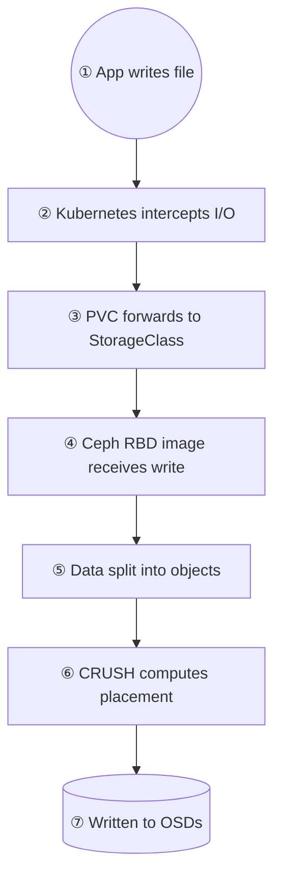
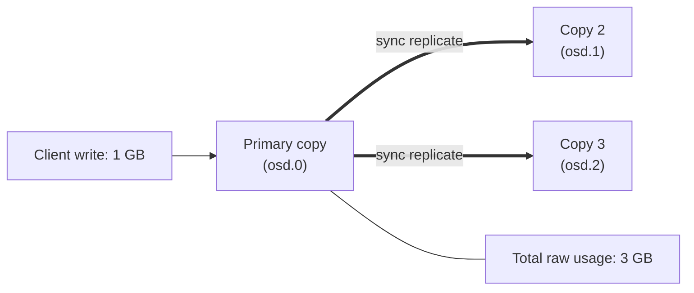

# Day 1 — Introduction to Ceph

**Version:** Ceph Squid (v19.x)

---

## Quick Summary

- Ceph is a distributed storage system providing **Block (RBD)**, **File (CephFS)**, and **Object (RGW/S3)** storage.
- No single point of failure — data is replicated across multiple nodes.
- Core daemons: **MON** (cluster state/quorum), **MGR** (dashboard/APIs), **OSD** (actual data storage).
- Data placement is handled automatically via **Placement Groups (PGs)** and the **CRUSH** algorithm — no central lookup table.
- Authentication is handled via **CephX**.
- This guide will deploy MON, MGR, OSD, Dashboard, cephadm, NGINX (reverse proxy), and Let's Encrypt (HTTPS).

---

## 1.1 What is Ceph?

Ceph is an open-source distributed storage platform designed to provide:

- **Block Storage** (RBD)
- **File Storage** (CephFS)
- **Object Storage** (RGW / S3 Compatible)

Unlike a traditional storage server, Ceph stores data across multiple servers, providing high availability, scalability, and fault tolerance.

---

## 1.2 Why Use Ceph?

**Traditional storage** relies on a single server, which is a single point of failure:



**Problems:**

- Single point of failure
- Limited scalability
- Expensive storage appliances
- Difficult expansion

**Ceph** distributes data across multiple nodes instead:



**Advantages:**

- No single point of failure
- Automatic replication
- Horizontal scaling
- Self-healing
- Open source

---

## 1.3 Ceph Architecture

A production Ceph cluster consists of multiple services:



Each service has a specific role.

---

## 1.4 Ceph Components

### Monitor (MON)

The Monitor maintains the cluster state.

**Responsibilities:**

- Cluster membership
- Quorum
- Authentication
- Cluster map

Without a healthy Monitor quorum, the cluster cannot operate normally.



> **Rule of thumb:** with 3 MONs, at least 2 must be available to maintain quorum.

### Manager (MGR)

The Manager provides:

- Dashboard
- REST APIs
- Monitoring
- Metrics
- Orchestration support

**Without the Manager:**

- Storage continues to work.
- Dashboard and management features are unavailable.

### OSD (Object Storage Daemon)

OSDs store the actual data. Each storage disk usually corresponds to one OSD.



### Placement Groups (PGs)

Ceph does not place data directly onto OSDs. Instead:



Placement Groups help distribute and rebalance data efficiently.

### CRUSH

CRUSH stands for:

**Controlled Replication Under Scalable Hashing**

CRUSH determines:

- Which OSD stores an object
- Where replicas are placed

No central lookup table is required — the location is computed algorithmically.

---

## 1.5 Data Flow

Suppose an application writes a file:



---

## 1.6 Replication

Assume a replication size of 3:



**Example:**

| OSD  | Data Stored |
|------|-------------|
| OSD1 | 1 GB        |
| OSD2 | 1 GB        |
| OSD3 | 1 GB        |

> The application writes 1 GB, but Ceph stores **3 GB** of raw data (replication factor 3).

---

## 1.7 CephX Authentication

Ceph uses **CephX** for authentication.

**Example users:**

```
client.admin
client.kubernetes
```

Each user has:

- Username
- Secret key
- Permissions

**Example capabilities:**

```
mon:
  allow r

osd:
  allow rwx pool=kubernetes
```

---

## 1.8 Ceph Services Used in This Guide

In this guide, we'll configure:

| Service | Purpose |
|---|---|
| **MON** | Cluster monitoring and quorum |
| **MGR** | Dashboard and management |
| **OSD** | Data storage |
| **Dashboard** | Web UI |
| **cephadm** | Cluster deployment and orchestration |
| **NGINX** | Reverse proxy |
| **Let's Encrypt** | HTTPS for the dashboard |

---

## What's Next

Continue to [`cluster-setup`](../setup-cluster/) to begin preparing the 3 Ubuntu machines for the Ceph cluster.
