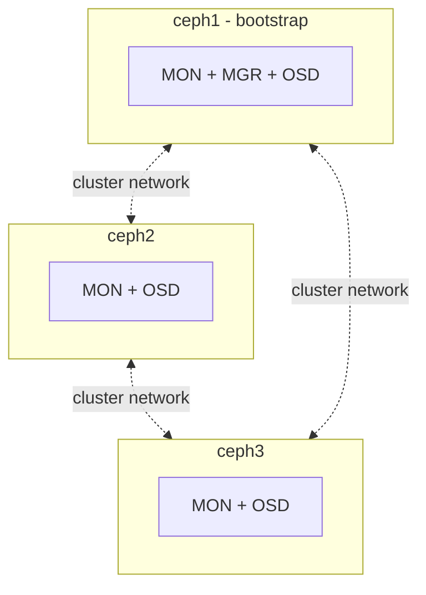
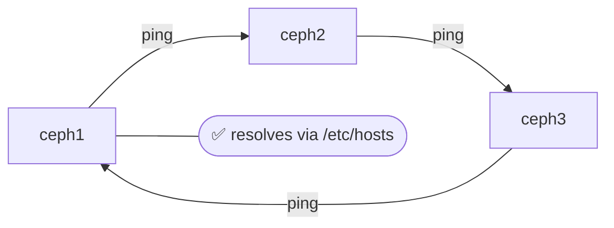
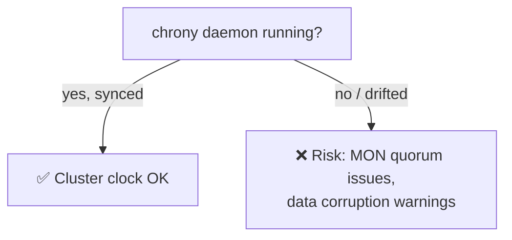
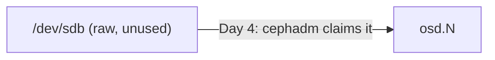
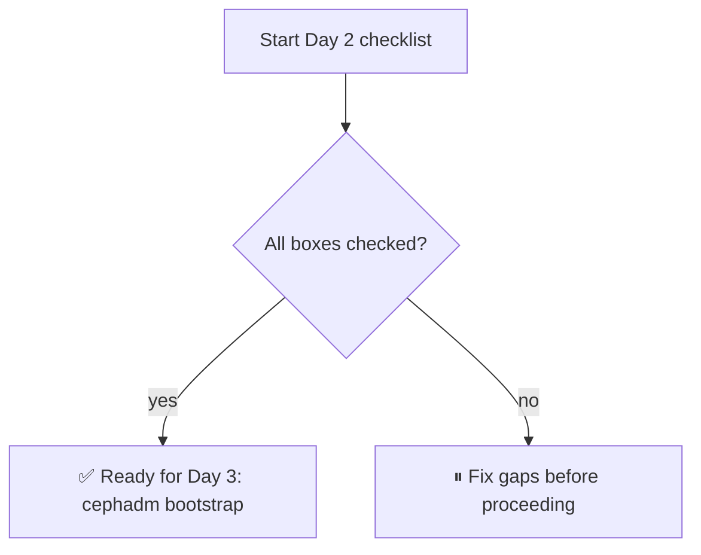

# Prerequisites and Node Setup (3 Ubuntu Machines)
 
Before installing Ceph with `cephadm`, we need to prep 3 Ubuntu machines so they're ready to form a cluster.
 
---
 
## Quick Summary
 
- 3 nodes total: `ceph1` (bootstrap node running MON+MGR+OSD), `ceph2`, `ceph3` (MON+OSD each).
- Each node needs: correct hostname, `/etc/hosts` entries, synced clocks, passwordless SSH from `ceph1`, a container runtime (Podman), Python3, one spare unformatted disk, and the right firewall ports open.
- This is all groundwork — no Ceph is actually installed yet. That happens in Day 3.
---
 
## 2.1 Lab Topology
 
| Hostname | Role | Example IP |
|----------|------|------------|
| ceph1 | MON, MGR, OSD (this is the bootstrap node) | 10.16.120.8 |
| ceph2 | MON, OSD | 10.16.120.10 |
| ceph3 | MON, OSD | 10.16.120.11 |
 
> Swap in your own IPs/hostnames as needed.
 

 
**Minimum specs per node:**
 
- Ubuntu 22.04 LTS (or 24.04 LTS)
- 2 vCPU / 4 GB RAM for lab use — 8+ GB RAM if this were production
- One spare, unused disk (separate from the OS disk) that will become an OSD
- All 3 nodes able to reach each other over the network
📸 *Screenshot placeholder — will add when uploading to GitHub*
 
---
 
## 2.2 Set Hostnames
 
Run the matching command on each node:
 
```bash
sudo hostnamectl set-hostname ceph1   # on node 1
sudo hostnamectl set-hostname ceph2   # on node 2
sudo hostnamectl set-hostname ceph3   # on node 3
```
 
---
 
## 2.3 Configure /etc/hosts
 
On **every** node, add all 3 entries:
 
```bash
sudo tee -a /etc/hosts <<EOF
10.16.120.8 ceph1
10.16.120.10 ceph2
10.16.120.12 ceph3
EOF
```
 
📸 *Screenshot placeholder*
 
Confirm they can all see each other:
 
```bash
ping -c 2 ceph1
ping -c 2 ceph2
ping -c 2 ceph3
```
 
📸 *Screenshot placeholder*
 

 
---
 
## 2.4 Update System Packages
 
On all 3 nodes:
 
```bash
sudo apt update && sudo apt upgrade -y
sudo apt install -y curl vim net-tools chrony
```
 
---
 
## 2.5 Time Synchronization (NTP)
 
Ceph really doesn't tolerate clock drift between nodes — even a few seconds off can cause issues. Make sure `chrony` is active:
 
```bash
sudo systemctl enable --now chrony
timedatectl
```
 
📸 *Screenshot placeholder*
 

 
---
 
## 2.6 Set Up SSH Key-Based Access
 
`cephadm` manages all nodes over SSH, so `ceph1` needs passwordless access to the others.
 
On **ceph1** (the bootstrap node):
 
```bash
ssh-keygen -t rsa -N "" -f ~/.ssh/id_rsa
 
ssh-copy-id root@ceph1
ssh-copy-id root@ceph2
ssh-copy-id root@ceph3
```
 
Test it:
 
```bash
ssh root@ceph2 hostname
ssh root@ceph3 hostname
```
 
If both return the hostname with no password prompt, you're good.
 
---
 
## 2.7 Install a Container Runtime (Podman)
 
`cephadm` runs every Ceph daemon as a container, so each node needs a runtime installed.
 
```bash
sudo apt install -y podman
podman --version
```
 
> Podman is the recommended default for `cephadm` on modern Ubuntu. Docker CE is also supported if that's your preference.
 
---
 
## 2.8 Install Python3
 
`cephadm` is a Python script, so this is required:
 
```bash
sudo apt install -y python3
python3 --version
```
 
---
 
## 2.9 Identify the Raw Disk for the OSD
 
On **each** node, find the spare disk that will become an OSD — **not** the OS disk:
 
```bash
lsblk
```
 
Example:
 
```
NAME    SIZE  TYPE
sda     40G   disk   ← OS disk, leave alone
└─sda1  40G   part
sdb     20G   disk   ← unused, this becomes the OSD
```
 
Double-check it has no existing filesystem:
 
```bash
sudo wipefs -n /dev/sdb
```
 
> `-n` is dry-run only — nothing gets wiped here. Ceph claims and formats the disk automatically in Day 4.
 

 
---
 
## 2.10 Open Required Firewall Ports
 
If `ufw` is active, open these on all 3 nodes:
 
```bash
sudo ufw allow 3300/tcp        # Monitor (msgr2)
sudo ufw allow 6789/tcp        # Monitor (legacy)
sudo ufw allow 6800:7300/tcp   # OSD/MGR daemons
sudo ufw allow 8443/tcp        # Dashboard (HTTPS)
sudo ufw allow 22/tcp          # SSH
sudo ufw reload
```
 
| Port(s) | Used by |
|---|---|
| 3300/tcp | Monitor (msgr2 protocol) |
| 6789/tcp | Monitor (legacy protocol) |
| 6800–7300/tcp | OSD and MGR daemons |
| 8443/tcp | Dashboard over HTTPS |
| 22/tcp | SSH (for cephadm management) |
 
---
 
## 2.11 Pre-Flight Checklist
 
- [ ] All 3 nodes ping each other by hostname
- [ ] Passwordless SSH works from ceph1 → ceph2 and ceph1 → ceph3
- [ ] Podman installed on every node
- [ ] Python3 installed on every node
- [ ] chrony is running and clocks are in sync
- [ ] Each node has one spare disk identified for its OSD
- [ ] Firewall ports opened on every node

 
---
 
## What's Next
 
Continue to [`Cephadm-Bootstrap.md`](./02.Cephadm-Bootstrap.md) to bootstrap the Ceph cluster on `ceph1`.
 
