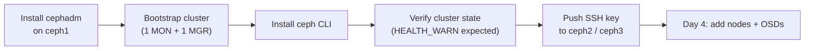
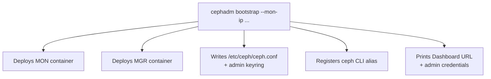
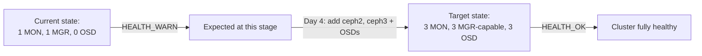

# Cephadm Bootstrap (Ceph Squid v19.x)

This guide bootstraps the Ceph cluster on the first node (`ceph1`) using `cephadm`.

---

## Quick Summary

- `cephadm` is installed and run **only on ceph1** first.
- `cephadm bootstrap` stands up a brand-new 1-node cluster: 1 MON + 1 MGR, plus config files and the Dashboard.
- At this point the cluster is expected to show **HEALTH_WARN** — that's normal, since there are no OSDs or extra MONs yet.
- `ceph2` and `ceph3` get added in Day 4, along with OSDs.



---

## 3.1 Install cephadm

Run this **on `ceph1` only** (not the other nodes yet):

``
`bashapt install -y cephadm

```

Verify it installed correctly:

```bash
cephadm version
```

## 3.1.1 comment and add this link in /etc/ssh/sshd_config comment sftp command and add below command 

```bash
Subsystem sftp /usr/lib/openssh/sftp-server
```
---

## 3.2 Bootstrap the Cluster

Still on `ceph1`:

```bash
 sudo cephadm bootstrap --mon-ip 10.16.120.8

```

##add public key which is created after bootstrap in all ceph 2, ceph 3 nodes

This one command does a lot in a single shot:

- Creates a brand-new Ceph cluster with one Monitor (MON) and one Manager (MGR) running on `ceph1`
- Generates a minimal `ceph.conf` and admin keyring under `/etc/ceph`
- Sets up the `ceph` CLI as a container-backed alias so you can run it like a normal command
- Prints out the Dashboard URL, username, and a one-time password — **save these somewhere**, you'll need them to log in



Example output you should expect:

```
Ceph Dashboard is now available at:
     URL: https://ceph1:8443/
    User: admin
Password: <auto-generated-password>
```

---

## 3.3 Install the ceph CLI Shell Alias

By default, `ceph` commands run inside a container. To run them directly from the host shell instead:

```bash
sudo cephadm install ceph-common
```

Then confirm it's working:

```bash
ceph -v
ceph status
```

At this stage, expect to see **HEALTH_WARN** — that's completely normal, since the cluster only has 1 MON and 0 OSDs so far.

---

## 3.4 Verify Initial Cluster State

```bash
ceph -s
```

You should see something close to this:

```
  cluster:
    id:     <uuid>
    health: HEALTH_WARN
            OSD count 0 < osd_pool_default_size 3

  services:
    mon: 1 daemons, quorum ceph1
    mgr: 1 daemon(s)
    osd: 0 osds: 0 up, 0 in
```



This warning is expected — `ceph2`, `ceph3`, and the OSDs haven't been added yet.

---

## 3.5 Copy the Cluster SSH Key to the Other Nodes

`cephadm` uses its **own** internal SSH key to manage remote hosts — this is separate from the manual SSH key you set up in Day 2.

```bash
ceph cephadm get-pub-key > ~/ceph.pub
ssh-copy-id -f -i ~/ceph.pub root@ceph2
ssh-copy-id -f -i ~/ceph.pub root@ceph3
```

> Two SSH keys are now in play: your personal key (Day 2, for you to SSH in manually) and cephadm's own key (this step, for cephadm to orchestrate the other nodes). Don't mix them up when troubleshooting access issues.

---

## What's Next

Continue to [`Add-Monitors-Managers-OSDs.md`](./03.Add_Monitors_Managers_and_OSDs.md) to scale the cluster to all 3 nodes and add OSDs.
