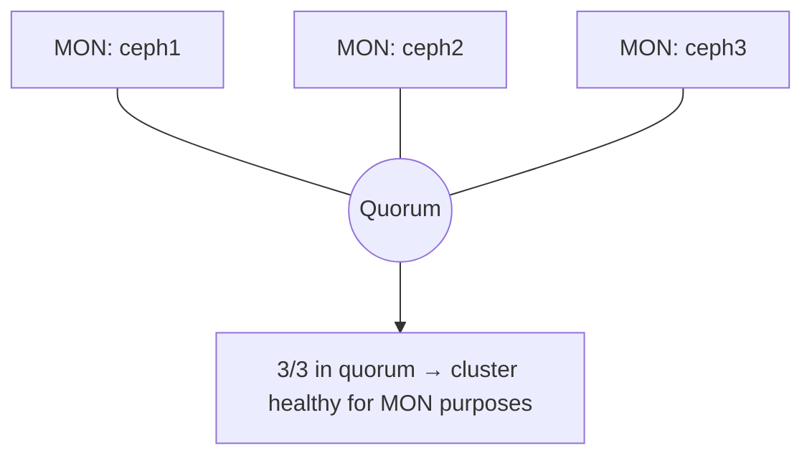
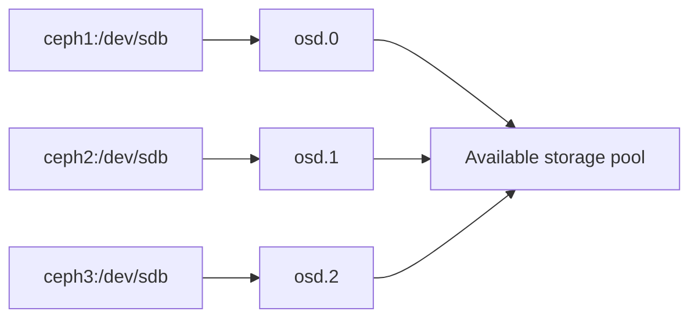
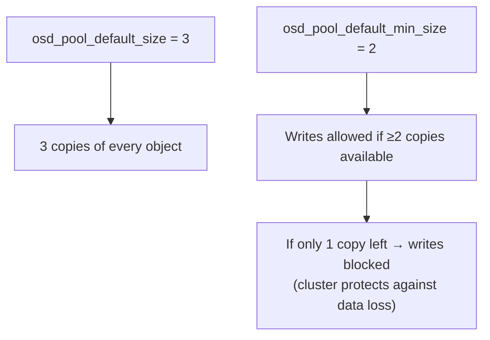
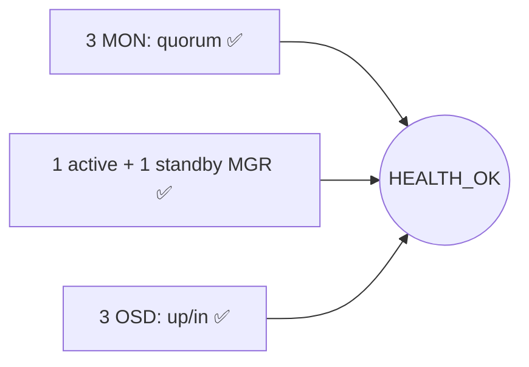

# Add Monitors, Managers, and OSDs (Scale to 3 Nodes)

This guide expands the single-node bootstrap from Day 3 into a full **3-node cluster** with MONs, MGRs, and OSDs running on every host.

---

## Quick Summary

- Register `ceph2` and `ceph3` with the cluster, then explicitly place MONs and a standby MGR across all 3 nodes.
- Claim each node's spare disk as an OSD (either all-at-once or one-by-one).
- Set replication size to 3 (standard for a 3-node cluster).
- End state: `HEALTH_OK`, 3 MONs in quorum, 1 active + 1 standby MGR, 3 OSDs up.

**Lab IPs used in this guide:**

| Hostname | IP |
|---|---|
| ceph1 | 10.16.120.8 |
| ceph2 | 10.16.120.10 |
| ceph3 | 10.16.120.11 |


---

## 4.1 Add ceph2 and ceph3 to the Cluster

Run from **ceph1**:

```bash
ceph orch host add ceph2 10.16.120.10
ceph orch host add ceph3 10.16.120.11
```

Confirm both hosts are now recognized by the orchestrator:

```bash
ceph orch host ls
```

Expected:

```
HOST   ADDR            LABELS  STATUS
ceph1  10.16.120.8     _admin
ceph2  10.16.120.10
ceph3  10.16.120.11
```

---

## 4.2 Deploy Additional Monitors

`cephadm` can auto-place MONs, but for a 3-node cluster it's cleaner to be explicit about placement:

```bash
ceph orch apply mon --placement="ceph1,ceph2,ceph3"
```

Check that all 3 are in quorum:

```bash
ceph mon stat
```

You're looking for all 3 listed together, something like:

```
e3: 3 mons at {ceph1=...,ceph2=...,ceph3=...}, election epoch 6, leader 0 ceph1, quorum 0,1,2 ceph1,ceph2,ceph3
```



---

## 4.3 Deploy an Additional Manager (for HA)

One MGR is a single point of failure for the dashboard/API layer, so add a standby:

```bash
ceph orch apply mgr --placement="ceph1,ceph2"
```

Check which one is active vs standby:

```bash
ceph -s | grep mgr
```

> Only one MGR is ever "active" at a time — the second one sits idle as a standby and takes over automatically if the active one goes down.

---

## 4.4 Add OSDs (One Disk per Node)

Back in Day 2, each node had one spare disk identified (e.g. `/dev/sdb`). Now it's time to actually claim those as OSDs.

**Option A — auto-claim every available unused disk (fine for a lab):**

```bash
ceph orch apply osd --all-available-devices
```

**Option B — target a specific disk per host explicitly (better for production, avoids surprises):**

```bash
ceph orch daemon add osd ceph1:/dev/sdb
ceph orch daemon add osd ceph2:/dev/sdb
ceph orch daemon add osd ceph3:/dev/sdb
```



---

## 4.5 Verify OSDs

```bash
ceph osd tree
```

Expected output — one `up` OSD per host:

```
ID  CLASS  WEIGHT   TYPE NAME       STATUS
-1         0.05878  root default
-3         0.01959      host ceph1
 0    hdd  0.01959          osd.0        up
-5         0.01959      host ceph2
 1    hdd  0.01959          osd.1        up
-7         0.01959      host ceph3
 2    hdd  0.01959          osd.2        up
```

---

## 4.6 Set Replication Size (Pool Default)

For a 3-node cluster, a replication size of 3 is the standard choice:

```bash
ceph config set global osd_pool_default_size 3
ceph config set global osd_pool_default_min_size 2
```

In plain terms: every piece of data gets 3 copies, and the cluster will keep accepting writes as long as at least 2 of those 3 copies are reachable.



---

## 4.7 Final Health Check

```bash
ceph -s
```

Target state:

```
  cluster:
    id:     <uuid>
    health: HEALTH_OK

  services:
    mon: 3 daemons, quorum ceph1,ceph2,ceph3
    mgr: ceph1(active), standbys: ceph2
    osd: 3 osds: 3 up, 3 in
```

`HEALTH_OK` confirms the 3-node cluster is fully operational — quorum established, redundancy in place, and storage active.



---

## What's Next

Continue to [`03-dashboard-access/Day-5-Dashboard-NGINX-LetsEncrypt.md`](../03-dashboard-access/Day-5-Dashboard-NGINX-LetsEncrypt.md) to expose the Ceph Dashboard securely via NGINX and Let's Encrypt.
