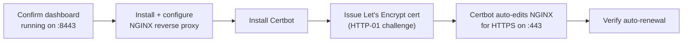
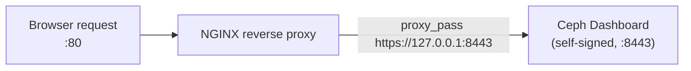
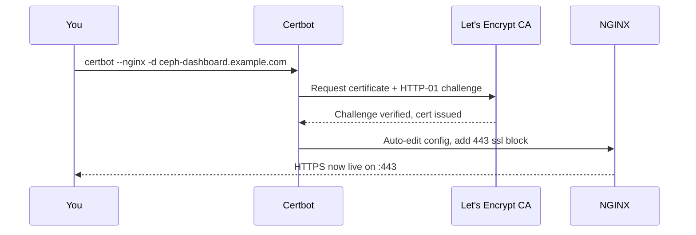
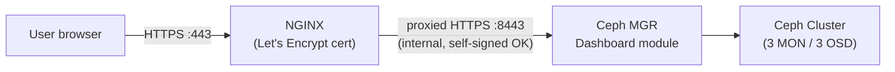
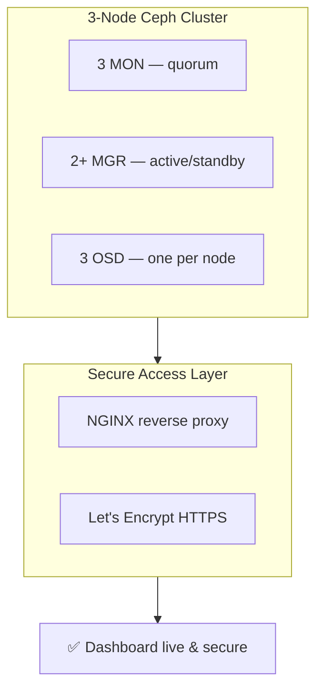

Ceph Dashboard, NGINX Reverse Proxy, and Let's Encrypt

By default, the Ceph Dashboard runs on port `8443` with a self-signed certificate — fine for internal testing, but not something you'd want browsers complaining about long-term. This guide puts **NGINX** in front of it as a reverse proxy and secures it with a proper **Let's Encrypt** certificate.

---

## Quick Summary

- Confirm the dashboard is up, reset the admin password if needed.
- Install NGINX and reverse-proxy port 80 → the dashboard's internal `8443`.
- Use Certbot to get a Let's Encrypt cert and let it auto-configure HTTPS on port 443.
- Verify auto-renewal is set up so the cert doesn't expire silently.



---

## 5.1 Confirm the Dashboard Is Running

```bash
ceph mgr services
```

Expected output:

```json
{
    "dashboard": "https://ceph1:8443/"
}
```

Log in with the credentials that were printed during the Day 3 bootstrap — or reset the password if you didn't save it:

```bash
echo "NewStrongPassword123" > /tmp/pass.txt
ceph dashboard ac-user-set-password admin -i /tmp/pass.txt
rm /tmp/pass.txt
```

> Deleting the temp file afterward matters — leaving a plaintext password file sitting on disk is exactly the kind of thing that gets flagged in a security review.

---

## 5.2 Install NGINX

Install this on whichever node will act as the reverse proxy — usually `ceph1` itself, or a dedicated front-end node if you have one:

```bash
sudo apt install -y nginx
```

---

## 5.3 Configure NGINX as a Reverse Proxy

Create the site config:

```bash
sudo tee /etc/nginx/sites-available/ceph-dashboard <<'EOF'
server {
    listen 80;
    server_name ceph-dashboard.example.com;

    location / {
        proxy_pass https://127.0.0.1:8443;
        proxy_ssl_verify off;
        proxy_set_header Host $host;
        proxy_set_header X-Real-IP $remote_addr;
        proxy_set_header X-Forwarded-For $proxy_add_x_forwarded_for;
        proxy_set_header X-Forwarded-Proto $scheme;
    }
}
EOF
```

> Swap `ceph-dashboard.example.com` for your actual domain, pointed at this node's IP.

Enable the site and reload:

```bash
sudo ln -s /etc/nginx/sites-available/ceph-dashboard /etc/nginx/sites-enabled/
sudo nginx -t
sudo systemctl reload nginx
```



---

## 5.4 Install Certbot for Let's Encrypt

```bash
sudo apt install -y certbot python3-certbot-nginx
```

---

## 5.5 Obtain and Install the SSL Certificate

```bash
sudo certbot --nginx -d ceph-dashboard.example.com
```

Certbot handles the rest automatically:

- Validates domain ownership using the HTTP-01 challenge
- Edits the NGINX config itself to add a `listen 443 ssl` block
- Installs the certificate and wires up auto-renewal



---

## 5.6 Verify Auto-Renewal

Certbot sets up a systemd timer on its own — just confirm it's actually there and working:

```bash
systemctl list-timers | grep certbot
sudo certbot renew --dry-run
```

If the dry run completes without errors, renewal is set up correctly and you shouldn't need to touch this again.

---

## 5.7 Final Access

The Ceph Dashboard is now reachable securely at:

```
https://ceph-dashboard.example.com
```

**Full traffic flow, end to end:**



---

## 5.8 Checklist

- [ ] Dashboard accessible directly on `:8443` (internal sanity check)
- [ ] NGINX installed and reverse-proxying to `:8443`
- [ ] DNS record for `ceph-dashboard.example.com` points to the proxy node
- [ ] Let's Encrypt certificate issued, NGINX serving HTTPS on `443`
- [ ] Auto-renewal confirmed via `certbot renew --dry-run`

---

## Guide Complete 🎉

At this point you have a fully functioning 3-node Ceph Squid cluster on Ubuntu, with:

- 3 MONs in quorum
- 2+ MGRs (active/standby)
- 3 OSDs (one per node)
- Dashboard secured behind NGINX + Let's Encrypt HTTPS


